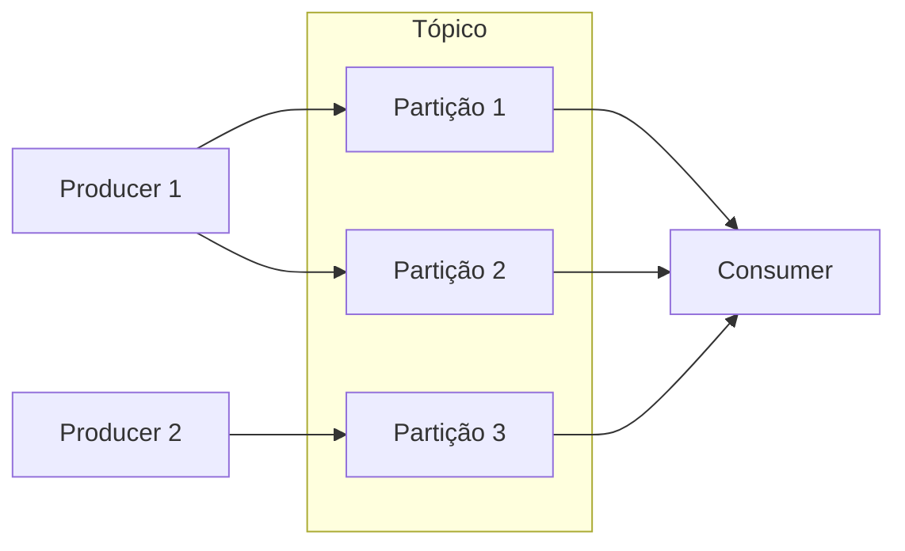

# Conceitos e terminologia

## Evento (record / mensagem)

Um **evento** registra o fato de que “algo aconteceu”. Na documentação também aparece como **record** ou **mensagem**.

Ao ler ou escrever no Kafka, você trabalha na forma de eventos. Um evento tem:

- **Chave** (key)
- **Valor** (value)
- **Timestamp**
- **Metadados** opcionais (headers)

Exemplo conceitual:

- Chave: `"Alice"`
- Valor: `"Pagamento de R$ 200 para Bob"`
- Timestamp: data/hora do evento

## Producers e consumers

- **Producers**: aplicações que **publicam (escrevem)** eventos no Kafka.
- **Consumers**: aplicações que **assinam (leem e processam)** esses eventos.

Producers e consumers são **desacoplados**: um não precisa “saber” do outro. O producer não espera o consumer; isso é fundamental para a escalabilidade do Kafka.

## Topics (tópicos)

Os eventos são organizados e armazenados em **tópicos**. De forma simplificada, um tópico é como uma pasta no sistema de arquivos, e os eventos são como os arquivos dentro dela.

- Um tópico pode ter **vários producers** e **vários consumers**.
- Os eventos **não são apagados** após a leitura. Você define por quanto tempo o Kafka deve reter os eventos (configuração por tópico); depois desse tempo, os antigos podem ser descartados.
- O desempenho do Kafka permanece praticamente constante em relação ao volume de dados armazenado.

## Partições

Os tópicos são **particionados**: o conteúdo é distribuído em várias “gavetas” (partições) em diferentes brokers. Isso permite que várias aplicações leiam e escrevam em paralelo.

- Cada evento publicado vai para **uma** das partições do tópico.
- Eventos com a **mesma chave** vão para a **mesma partição**, e a ordem de escrita nessa partição é preservada para quem consome.

## Replicação

Para tolerância a falhas e alta disponibilidade, cada tópico pode ser **replicado**: várias cópias dos dados são mantidas em diferentes brokers (inclusive entre datacenters, se configurado). A replicação é feita no nível de **partição**. Em produção é comum usar fator de replicação 3 (três cópias).

## Offset

Dentro de cada partição, cada evento recebe um **offset** (número sequencial). O consumer controla a partir de qual offset está lendo; assim o Kafka sabe o “progresso” de cada consumer naquela partição.

## Resumo

| Conceito | Descrição |
|----------|-----------|
| Evento | Registro de algo que aconteceu (key, value, timestamp, headers) |
| Producer | Publica eventos em tópicos |
| Consumer | Lê e processa eventos dos tópicos |
| Topic | “Pasta” onde os eventos são armazenados |
| Partição | Subdivisão do tópico para paralelismo e ordem por chave |
| Replicação | Cópias das partições em vários brokers |
| Offset | Posição sequencial de um evento dentro de uma partição |

## Referências

- [Main Concepts and Terminology — Apache Kafka](https://kafka.apache.org/documentation/#intro_concepts_and_terms)
- [Topics and partitions](https://kafka.apache.org/documentation/#design_topics)
