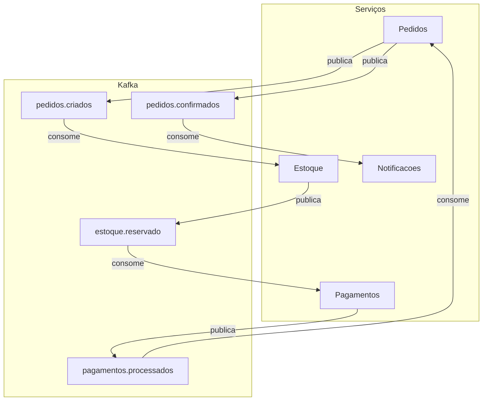
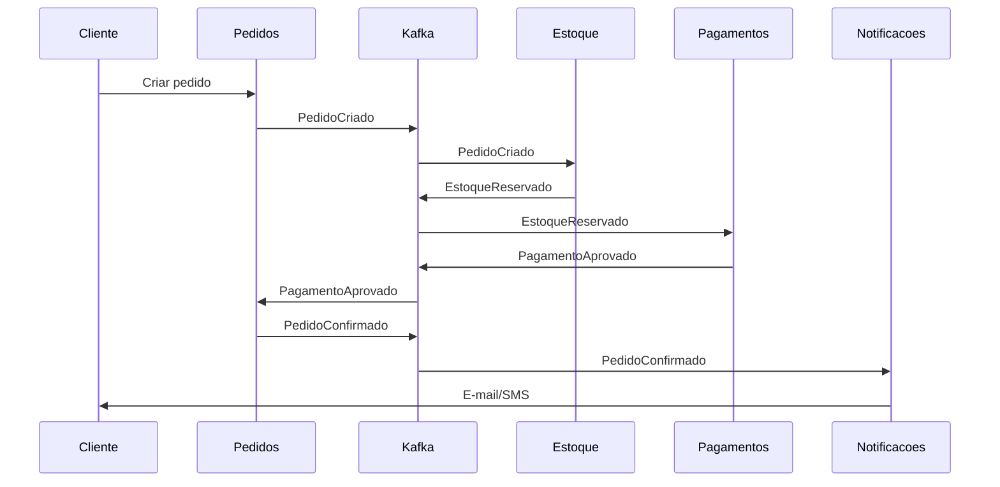

# Sistema de vendas com microserviços e Kafka

## 1. Introdução e objetivos de aprendizado

Este documento descreve um **sistema de vendas** desenhado em **arquitetura de microserviços** com o **Apache Kafka** como barramento de eventos. O objetivo é puramente **didático**: servir de material para entender na prática como microserviços se organizam, como a arquitetura ganha resiliência e de que forma o Kafka atua na comunicação entre serviços.

**Objetivos de aprendizado:**

- Entender como uma arquitetura em microserviços funciona no contexto de um sistema de vendas (domínio conhecido, fluxo claro).
- Compreender como a resiliência é alcançada: isolamento de falhas, retentativas, compensação e consistência eventual.
- Aprender como o Kafka atua na construção: eventos, tópicos, producers/consumers, desacoplamento e escalabilidade.

---

## 2. Domínio: sistema de vendas (escopo didático)

O domínio é simplificado para fins de estudo. O fluxo principal é:

**Cliente faz pedido → validação de estoque → processamento de pagamento → notificação ao cliente.**

Os serviços considerados, cada um com **uma responsabilidade bem definida**, são:

| Serviço | Responsabilidade |
|--------|-------------------|
| **Pedidos (Order)** | Criação e gestão do ciclo de vida do pedido (criado, aguardando estoque, aguardando pagamento, confirmado, cancelado). |
| **Catálogo/Estoque (Inventory)** | Produtos e disponibilidade; reserva e liberação de itens por pedido. |
| **Pagamentos (Payment)** | Processamento de pagamento (gateway simulado ou integração com adquirente). |
| **Notificações (Notification)** | Envio de e-mail/SMS ao cliente (confirmação de pedido, aviso de envio, etc.). |

Cada serviço possui seu **próprio modelo de dados** e, na prática, seu próprio armazenamento (banco ou outro), sem compartilhar tabelas com os demais.

---

## 3. Arquitetura em microserviços

Em microserviços, o sistema é dividido em **serviços independentes**, cada um deployável e escalável de forma isolada. Benefícios relevantes para este caso:

- **Independência de deploy:** atualizar Notificações não exige subir Pedidos ou Pagamentos.
- **Escala por contexto:** em pico de vendas, pode-se escalar apenas Pedidos e Pagamentos; Notificações pode ter menos réplicas.
- **Tecnologia por serviço:** cada equipe pode escolher linguagem e banco adequados ao seu contexto (bounded context).

A comunicação entre serviços é **assíncrona por eventos**: em vez de um serviço chamar outro via HTTP para orquestrar o fluxo, um serviço **publica um evento** quando algo relevante acontece; outros **reagem** consumindo esse evento. O **Kafka** atua como o **barramento** onde esses eventos são publicados e consumidos.

Princípios aplicados:

- **Comunicação assíncrona via eventos:** nenhum serviço “chama” outro diretamente para orquestrar o fluxo; todos se comunicam via Kafka.
- **Desacoplamento:** produtores não sabem quem consome; consumidores não sabem quem produziu; novos consumidores podem ser adicionados sem alterar produtores.
- **Cada serviço com seu modelo de dados:** Pedidos não acessa tabela de estoque; Estoque não acessa tabela de pagamentos; a verdade é propagada por eventos.

---

## 4. Papel do Kafka na arquitetura

O Kafka funciona como **event backbone** (espinha dorsal de eventos): aplicações publicam eventos em **tópicos** e outras aplicações assinam esses tópicos para processá-los. Os conceitos principais usados neste sistema são:

- **Evento (record):** registro de que “algo aconteceu” (ex.: “Pedido X foi criado”), com chave, valor, timestamp e metadados opcionais. Ver [kafka/02-conceitos-e-terminologia.md](kafka/02-conceitos-e-terminologia.md).
- **Tópico:** canal onde eventos são armazenados (ex.: `pedidos.criados`, `pagamentos.processados`). Vários producers e consumers podem usar o mesmo tópico.
- **Producer:** serviço que publica eventos em tópicos (ex.: Pedidos publica em `pedidos.criados`).
- **Consumer:** serviço que lê e processa eventos de tópicos (ex.: Estoque consome `pedidos.criados`). Producers e consumers são desacoplados; escalabilidade horizontal é obtida com **partições** e **consumer groups**. Ver [kafka/07-consumer-groups-e-share-consumer.md](kafka/07-consumer-groups-e-share-consumer.md).

**Visão tópico × evento × produtor × consumidor(es):**

| Tópico | Evento (exemplo) | Produtor | Consumidor(es) |
|--------|------------------|----------|-----------------|
| `pedidos.criados` | PedidoCriado | Pedidos | Estoque |
| `estoque.reservado` | EstoqueReservado / EstoqueInsuficiente | Estoque | Pagamentos, Pedidos |
| `pagamentos.processados` | PagamentoAprovado / PagamentoRecusado | Pagamentos | Pedidos |
| `pedidos.confirmados` | PedidoConfirmado | Pedidos | Notificações |

Cada serviço atua como **producer** em pelo menos um tópico e como **consumer** em outro(s), sem necessidade de conhecer todos os participantes do fluxo.

---

## 5. Fluxo de um pedido (passo a passo)

Segue a narrativa do fluxo com eventos e reações de cada serviço.

1. **Cliente cria pedido**  
   O serviço **Pedidos** recebe a requisição (API REST ou outro), persiste o pedido e publica o evento **PedidoCriado** no tópico `pedidos.criados` (ex.: com `orderId`, itens, valor, `customerId`).

2. **Reserva de estoque**  
   O serviço **Estoque** consome **PedidoCriado** do tópico `pedidos.criados`. Tenta reservar os itens do pedido.  
   - Se conseguir: publica **EstoqueReservado** em `estoque.reservado`.  
   - Se não houver quantidade suficiente: publica **EstoqueInsuficiente** (ou similar) para que Pedidos possa cancelar ou notificar.

3. **Processamento de pagamento**  
   O serviço **Pagamentos** consome **EstoqueReservado** do tópico `estoque.reservado`. Processa o pagamento (gateway simulado ou real).  
   - Sucesso: publica **PagamentoAprovado** em `pagamentos.processados`.  
   - Falha: publica **PagamentoRecusado** no mesmo tópico (ou em um tópico dedicado).

4. **Atualização do pedido**  
   O serviço **Pedidos** consome `pagamentos.processados`.  
   - **PagamentoAprovado:** atualiza o pedido para “confirmado” e publica **PedidoConfirmado** em `pedidos.confirmados`.  
   - **PagamentoRecusado:** atualiza para “cancelado” e pode publicar evento de cancelamento (estoque libera a reserva se consumir esse evento).

5. **Notificação ao cliente**  
   O serviço **Notificações** consome **PedidoConfirmado** do tópico `pedidos.confirmados` e envia e-mail e/ou SMS ao cliente com a confirmação do pedido.

Este fluxo ilustra um **orquestração implícita** por eventos: não há um orquestrador central; cada serviço reage aos eventos e produz novos eventos que dão continuidade ao processo.

---

## 6. Resiliência na arquitetura

A arquitetura baseada em eventos e no Kafka contribui para a resiliência de várias formas.

**Isolamento de falhas**  
Se o serviço de Notificações cair ou ficar lento, Pedidos e Pagamentos continuam funcionando. Os eventos **PedidoConfirmado** permanecem no Kafka e serão consumidos quando Notificações voltar. A fila do Kafka absorve picos e falhas temporárias.

**Garantias de entrega**  
No Kafka, é importante definir a semântica desejada (at-most-once, at-least-once, exactly-once). Para este cenário, **at-least-once** é comum: o consumer processa a mensagem e depois commita o offset; em caso de falha antes do commit, a mensagem pode ser reprocessada. Para evitar efeitos duplicados (ex.: cobrar duas vezes), os consumidores devem ser **idempotentes** (verificar se já processaram aquele evento, ex.: por `orderId`). Detalhes em [kafka/05-semanticas-de-entrega.md](kafka/05-semanticas-de-entrega.md).

**Retry e dead letter**  
Se o processamento de um evento falhar, a aplicação pode: (1) não commitar o offset e reprocessar depois, ou (2) enviar a mensagem para uma fila de retentativa e, após N falhas, para um tópico **dead letter** (DLQ) para análise e correção manual ou reprocessamento controlado.

**Consistência eventual e compensação**  
Não há transação distribuída entre os serviços. A consistência é **eventual**: em algum momento, após todos os eventos serem processados, os estados dos serviços ficam alinhados. Se algo falhar no meio (ex.: pagamento aprovado mas o serviço de Pedidos cai antes de publicar PedidoConfirmado), é necessário um mecanismo de **compensação**: por exemplo, um processo que detecta pagamentos aprovados sem pedido confirmado e emite estorno e liberação de estoque. Esse padrão é conhecido como **Saga** (cada etapa tem uma ação de compensação em caso de falha posterior).

A replicação e a durabilidade dos dados no Kafka também ajudam: mensagens committed não se perdem enquanto houver réplicas disponíveis. Ver [kafka/06-replicacao-e-confiability.md](kafka/06-replicacao-e-confiability.md).

---

## 7. Escalabilidade e Kafka

O Kafka permite escalar o processamento de eventos de duas formas principais:

**Consumer groups**  
Várias instâncias do mesmo serviço (ex.: três instâncias de Notificações) podem formar um **consumer group**. Cada partição do tópico é consumida por apenas um consumer do grupo; assim, o trabalho é distribuído. Se houver mais instâncias do que partições, algumas ficam ociosas. Ver [kafka/07-consumer-groups-e-share-consumer.md](kafka/07-consumer-groups-e-share-consumer.md).

**Partições e chave**  
Para manter a **ordem** dos eventos de um mesmo pedido, os eventos podem ser publicados com **chave** igual ao `orderId` (ou `customerId`). No Kafka, eventos com a mesma chave vão para a mesma partição, e a ordem é preservada dentro da partição. Assim, todos os eventos de um pedido são processados na mesma ordem por um único consumer daquela partição.

---

## 8. Resumo e próximos passos

**Resumo:**

- **Microserviços:** sistema de vendas dividido em Pedidos, Estoque, Pagamentos e Notificações, cada um com responsabilidade e modelo de dados próprios.
- **Kafka como barramento de eventos:** comunicação assíncrona por tópicos; producers publicam eventos, consumers reagem; desacoplamento e capacidade de evoluir cada serviço de forma independente.
- **Resiliência:** isolamento de falhas, uso de semânticas de entrega (ex.: at-least-once) e idempotência, retry/dead letter e compensação (Saga) para consistência eventual.
- **Escalabilidade:** consumer groups e partições com chave (ex.: `orderId`) para paralelismo e ordem por pedido.

**Próximos passos sugeridos:**

1. Subir o Kafka localmente seguindo o [quickstart da documentação Kafka deste repositório](kafka/11-quickstart.md).
2. Implementar um primeiro serviço (ex.: **Pedidos**) que receba criação de pedido via API e publique **PedidoCriado** em `pedidos.criados`.
3. Implementar um consumer (ex.: **Notificações**) que leia de `pedidos.confirmados` e simule o envio de e-mail (log ou serviço fake).
4. Estender gradualmente: Estoque consumindo `pedidos.criados`, Pagamentos consumindo `estoque.reservado`, e Pedidos consumindo `pagamentos.processados`, fechando o fluxo descrito neste documento.

---

## 9. Referências

- [kafka/README.md](kafka/README.md) — Índice da documentação Kafka neste repositório.
- [kafka/01-introducao.md](kafka/01-introducao.md) — O que é event streaming e o que é o Kafka.
- [kafka/02-conceitos-e-terminologia.md](kafka/02-conceitos-e-terminologia.md) — Eventos, producers, consumers, topics, partições, replicação.
- [kafka/05-semanticas-de-entrega.md](kafka/05-semanticas-de-entrega.md) — At-least-once, at-most-once, exactly-once e transações.
- [kafka/06-replicacao-e-confiability.md](kafka/06-replicacao-e-confiability.md) — Replicação, ISR e disponibilidade.
- [kafka/07-consumer-groups-e-share-consumer.md](kafka/07-consumer-groups-e-share-consumer.md) — Consumer groups e escalabilidade.
- [kafka/11-quickstart.md](kafka/11-quickstart.md) — Passo a passo para subir Kafka e testar.
- [Documentação oficial — Apache Kafka](https://kafka.apache.org/documentation/)
