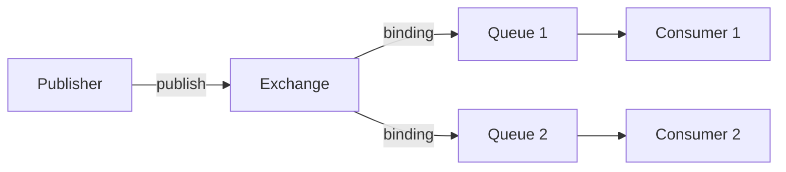

# Conceitos e terminologia

## Mensagem (message)

Uma **mensagem** é a unidade de dados que flui pelo broker. Ela possui:

- **Payload**: o conteúdo (bytes opacos para o broker; em geral JSON, Protocol Buffers, etc.).
- **Atributos** (metadados): routing key, content-type, content-encoding, delivery mode (persistente ou não), timestamp, expiration, priority, headers, etc.

Alguns atributos são usados pelo broker para roteamento e durabilidade; outros são apenas repassados aos consumers.

## Publishers e consumers

- **Publishers (producers)**: aplicações que **publicam** mensagens em **exchanges**. Não enviam diretamente para filas.
- **Consumers**: aplicações que **consomem** mensagens de **queues**. Podem receber por push (inscrição) ou, em teoria, por pull (polling), sendo o push o recomendado.

Publishers e consumers são **desacoplados**: o publisher não precisa saber quantos consumers existem; o consumer não precisa saber quem publicou.

## Exchanges (trocadores)

**Exchanges** são entidades para onde os publishers enviam mensagens. Eles **não armazenam** mensagens; apenas **roteiam** para uma ou mais queues (ou para outros exchanges, no caso de exchange-to-exchange bindings).

- Cada exchange tem um **tipo** (direct, fanout, topic, headers) que define a lógica de roteamento.
- O **default exchange** é um direct exchange embutido: toda queue criada é automaticamente ligada a ele com routing key igual ao nome da queue, permitindo “publicar direto na fila” em cenários simples.

## Queues (filas)

**Queues** são buffers que **armazenam** mensagens até serem consumidas.

- Uma mensagem pode ser roteada para **zero ou mais** queues, dependendo do exchange e dos bindings.
- Queues podem ser **durable** (sobrevivem a reinício do broker) ou **transient**.
- Nomes de filas podem ser escolhidos pela aplicação ou gerados pelo broker (filas temporárias).

## Bindings (vinculações)

**Bindings** são regras que ligam um **exchange** a uma **queue** (ou a outro exchange). Elas definem **quais** mensagens publicadas naquele exchange devem ir para aquela queue.

- Em exchanges **direct**, o binding tem uma **routing key**; a mensagem vai para a queue se a routing key da mensagem for **igual** à do binding.
- Em exchanges **topic**, o binding usa um **padrão** (ex.: `pedidos.#`, `*.critico`); a mensagem vai se o routing key da mensagem **bater** no padrão.
- Em **fanout**, não há filtro por routing key; todas as mensagens vão para todas as queues ligadas.

## Routing key

A **routing key** é um atributo da mensagem (string) usado pelos exchanges para decidir para quais queues rotear. No direct é comparação exata; no topic é comparação por padrão com wildcards (`*` e `#`).

## Fluxo resumido

1. Publisher envia mensagem para um **exchange** (com routing key e outros atributos).
2. Exchange aplica sua **lógica de tipo** e as **bindings** e envia cópias da mensagem para as queues correspondentes.
3. Mensagens ficam na **queue** até um **consumer** recebê-las e confirmar (ack) o processamento.

## Resumo

| Conceito | Descrição |
|----------|-----------|
| Mensagem | Unidade de dados (payload + atributos como routing key, headers) |
| Publisher | Publica mensagens em exchanges |
| Consumer | Consome mensagens de queues |
| Exchange | Roteia mensagens para queues (não armazena) |
| Queue | Armazena mensagens até o consumo |
| Binding | Regra que liga exchange → queue (e define critério de roteamento) |
| Routing key | Atributo da mensagem usado no roteamento (direct/topic) |

## Referências

- [AMQP 0-9-1 Model Explained — RabbitMQ](https://www.rabbitmq.com/tutorials/amqp-concepts.html)
- [Exchanges](https://www.rabbitmq.com/docs/exchanges)
- [Queues](https://www.rabbitmq.com/docs/queues)
